[](https://classroom.github.com/a/qlAtkCwb)
[](https://classroom.github.com/open-in-codespaces?assignment_repo_id=20344671)
# SESION DE LABORATORIO N° 01: PRUEBAS ESTATICAS DE SEGURIDAD DE APLICACIONES CON SONARQUBE

## OBJETIVOS
  * Comprender el funcionamiento de las pruebas estaticas de seguridad de còdigo de las aplicaciones que desarrollamos utilizando SonarQube.

## REQUERIMIENTOS
  * Conocimientos: 
    - Conocimientos básicos de Bash (powershell).
    - Conocimientos básicos de Contenedores (Docker).
  * Hardware:
    - Virtualization activada en el BIOS..
    - CPU SLAT-capable feature.
    - Al menos 4GB de RAM.
  * Software:
    - Windows 10 64bit: Pro, Enterprise o Education (1607 Anniversary Update, Build 14393 o Superior)
    - Docker Desktop 
    - Powershell versión 7.x
    - Net 8 o superior
    - Visual Studio Code

## CONSIDERACIONES INICIALES
  * Clonar el repositorio mediante git para tener los recursos necesarios
  * Tener una cuenta de Github valida. 

## DESARROLLO
### Parte I: Configuración de la herramienta de Pruebas Estaticas de Seguridad de la Aplicación
1. Ingrear a la pagina de SonarCloud (https://www.sonarsource.com/products/sonarcloud/), iniciar sesión con su cuenta de Github.

    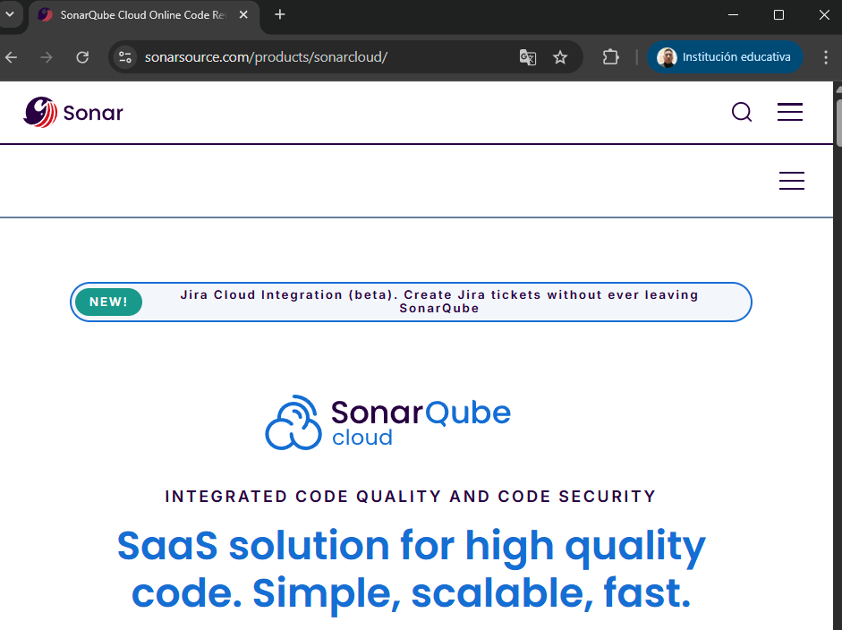

2. Ingresar a la opción My Account

    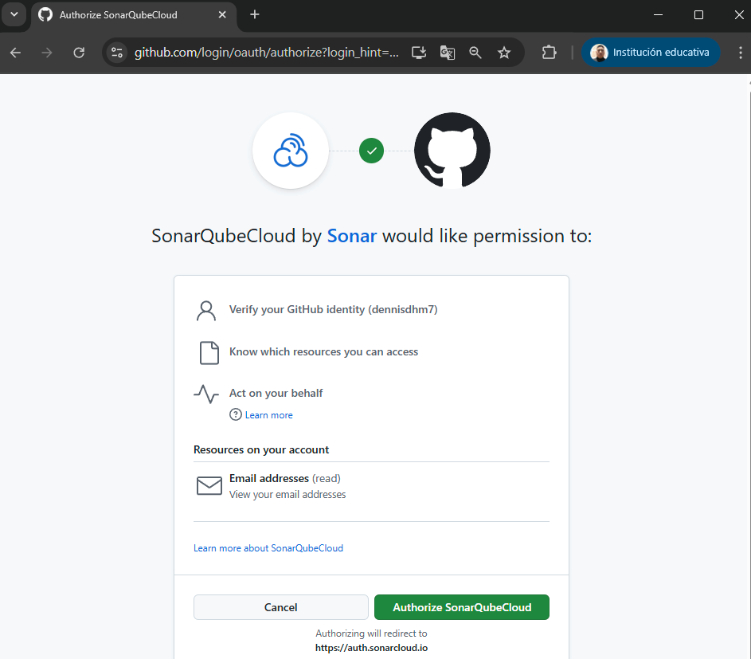
   
3. Generar un nuevo token con el nombre que desee, luego de generar el token, guarde el resultado en algún archivo o aplicación de notas. Debido a que se utilizará

    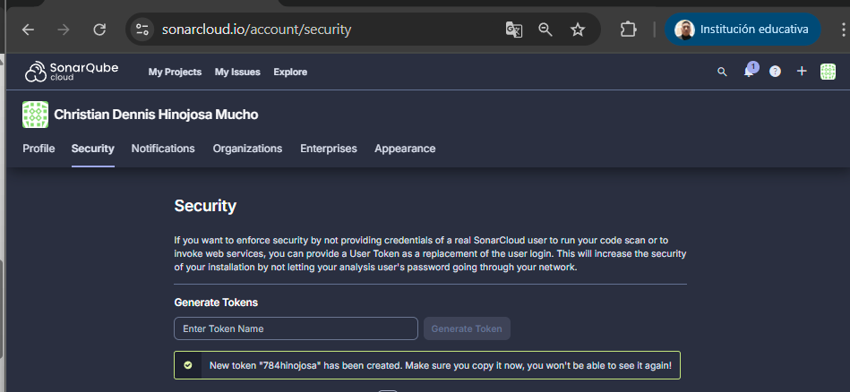
  
4. En el navegador, ingresar a la url https://sonarcloud.io/projects/create, para generar un nuevo proyecto con el nombre apibank, apunte el nombre del Project Key, que se utilizara mas adelante, luego dar click en el boton next.

    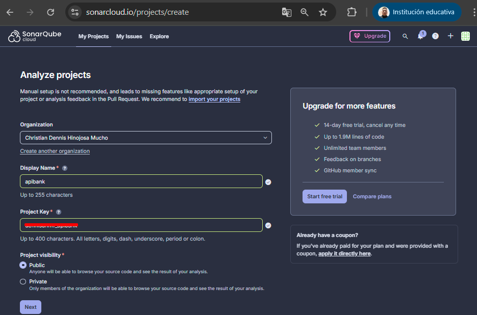
   
5. En el navegador, finalizar la creación del proyecto, haciendo click en la opción Previous Version, y luego en el boton Create Project

    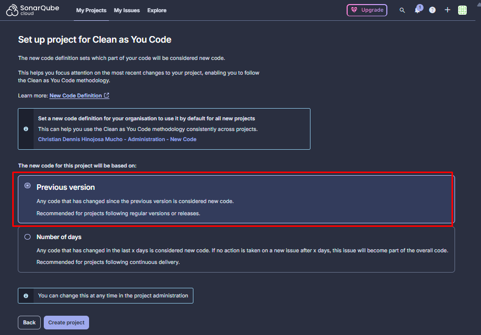


### Parte II: Creación de la aplicación
1. Iniciar la aplicación Powershell o Windows Terminal en modo administrador 

    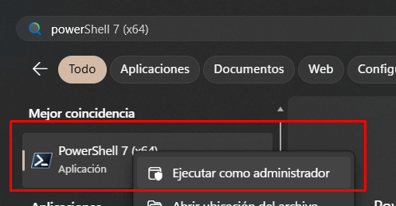

2. Ejecutar el siguiente comando para crear una nueva solución
    ```
    dotnet new sln -o Bank
    ```
3. Acceder a la solución creada y ejecutar el siguiente comando para crear una nueva libreria de clases y adicionarla a la solución actual.
    ```
    cd Bank
    dotnet new classlib -o Bank.Domain
    dotnet sln add ./Bank.Domain/Bank.Domain.csproj
    ```
    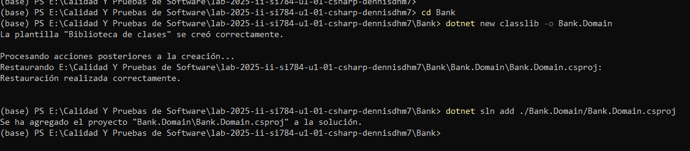

4. Ejecutar el siguiente comando para crear un nuevo proyecto de pruebas y adicionarla a la solución actual
    ```
    dotnet new mstest -o Bank.Domain.Tests
    dotnet sln add ./Bank.Domain.Tests/Bank.Domain.Tests.csproj
    dotnet add ./Bank.Domain.Tests/Bank.Domain.Tests.csproj reference ./Bank.Domain/Bank.Domain.csproj
    ```
    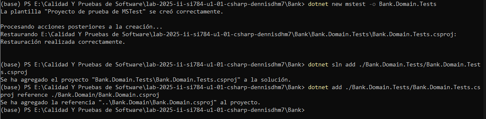

5. Iniciar Visual Studio Code (VS Code) abriendo el folder de la solución como proyecto. En el proyecto Bank.Domain, si existe un archivo Class1.cs proceder a eliminarlo. Asimismo en el proyecto Bank.Domain.Tests si existiese un archivo UnitTest1.cs, también proceder a eliminarlo.

    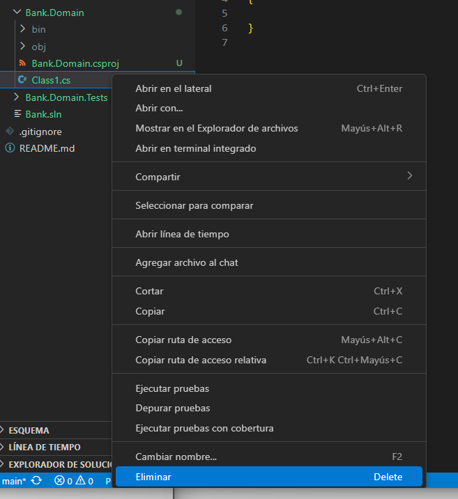

    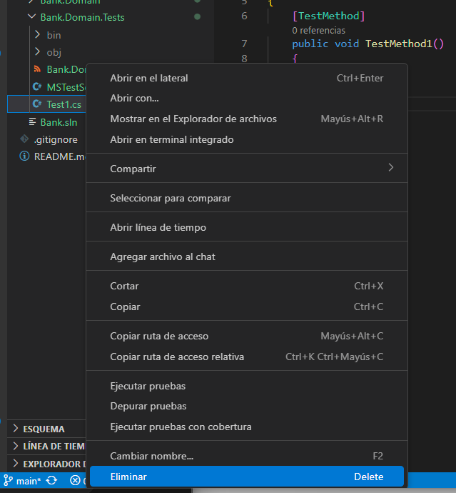

6. En VS Code, en el proyecto Bank.Domain proceder a crear la carpeta `Models` y dentro de esta el archivo BankAccount.cs e introducir el siguiente código:
    ```C#
    namespace Bank.Domain.Models
    {
        public class BankAccount
        {
            private readonly string m_customerName;
            private double m_balance;
            private BankAccount() { }
            public BankAccount(string customerName, double balance)
            {
                m_customerName = customerName;
                m_balance = balance;
            }
            public string CustomerName { get { return m_customerName; } }
            public double Balance { get { return m_balance; }  }
            public void Debit(double amount)
            {
                if (amount > m_balance)
                    throw new ArgumentOutOfRangeException("amount");
                if (amount < 0)
                    throw new ArgumentOutOfRangeException("amount");
                m_balance -= amount;
            }
            public void Credit(double amount)
            {
                if (amount < 0)
                    throw new ArgumentOutOfRangeException("amount");
                m_balance += amount;
            }
        }
    }
    ```

7. Luego en el proyecto Bank.Domain.Tests añadir un nuevo archivo BanckAccountTests.cs e introducir el siguiente código:
    ```C#
    using Bank.Domain.Models;
    using Microsoft.VisualStudio.TestTools.UnitTesting;

    namespace Bank.Domain.Tests
    {
        [TestClass] // 👈 Necesario para que MSTest reconozca la clase como contenedora de tests
        public class BankAccountTests
        {
            [TestMethod] // 👈 Necesario para que MSTest detecte este método como test
            public void Debit_WithValidAmount_UpdatesBalance()
            {
                // Arrange
                double beginningBalance = 11.99;
                double debitAmount = 4.55;
                double expected = 7.44;
                BankAccount account = new BankAccount("Mr. Bryan Walton", beginningBalance);

                // Act
                account.Debit(debitAmount);

                // Assert
                double actual = account.Balance;
                Assert.AreEqual(expected, actual, 0.001, "Account not debited correctly");
            }
        }
    }
    ```

8. En el terminal, ejecutar las pruebas de lo construido hasta el momento:
    ```Bash
    dotnet test --collect:"XPlat Code Coverage"
    ```
    > Resultado
    ```Bash
    Failed!  - Failed:     0, Passed:     1, Skipped:     0, Total:     1, Duration: < 1 ms
    ```
   
    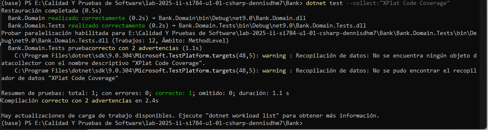

9. En el terminal, instalar la herramienta de .Net Sonar Scanner que permitirá conectarse a SonarQube para realizar las pruebas estáticas de la seguridad del código de la aplicación :
    ```Bash
    dotnet tool install -g dotnet-sonarscanner
    ```
    > Resultado
    ```Bash
    Puede invocar la herramienta con el comando siguiente: dotnet-sonarscanner
    La herramienta "dotnet-sonarscanner" (versión 'X.X.X') se instaló correctamente
    ```

    

10. En el terminal, ejecutar :
    ```Bash
    dotnet sonarscanner begin /k:"PROJECT_KEY" /d:sonar.token="TOKEN" /d:sonar.host.url="https://sonarcloud.io" /o:"ORGANIZATION" /d:sonar.cs.opencover.reportsPaths="*/*/*/coverage.opencover.xml"
    ```
    > Donde:
    > - TOKEN: es el token que previamente se genero en la pagina de Sonar Source
    > - ORGANIZATION: es el nombre de la organización generada en Sonar Source
    > - PROJECT_KEY: es el nombre de la llave proyecto que previamente se genero en la pagina en Sonar Source

    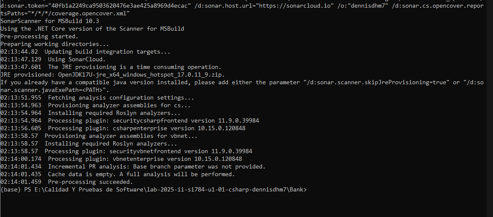

12. En el terminal, ejecutar:
    ```Bash
    dotnet build --no-incremental
    dotnet test --collect:"XPlat Code Coverage;Format=opencover"
    ```
    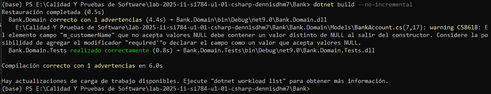

    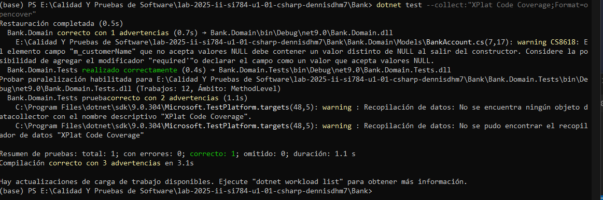

12. Ejecutar nuevamente el paso 8 para lo cual se obtendra una respuesta similar a la siguiente:
    ```Bash
    dotnet sonarscanner end /d:sonar.token="TOKEN"
    ```

    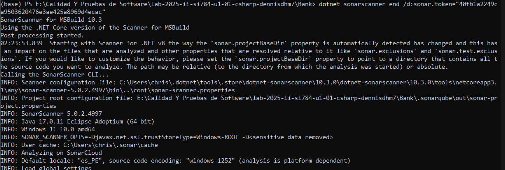

13. En la pagina de Sonar Source verificar el resultado del analisis.

    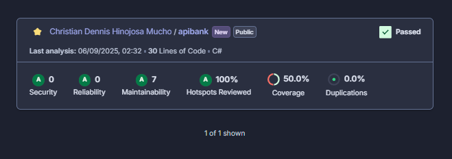

14. Abrir un nuevo navegador de internet o pestaña con la url de su repositorio de Github ```https://github.com/UPT-FAING-EPIS/nombre_de_su_repositorio```, abrir la pestaña con el nombre *Settings*, en la opción *Secrets and Actions*, selecionar Actions y hacer click en el botón *New Respository Token*, en la ventana colocar en Nombre (Name): SONAR_TOKEN y en Secreto (Secret): el valor del token de Sonar Cloud, guardado previamente

    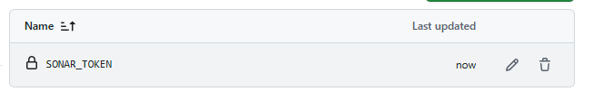

15. En el VS Code, proceder a crear la carpeta .github/workflow y dentro de esta crear el archivo sonar.yml con el siguiente contenido, reemplazar los valores ORGANIZATION y PROJECT_KEY con los valores obtenidos de SonarCloud
    ```Yaml
    name: Sonar Continuos Integration
    env:
      DOTNET_VERSION: '8.x'                     # la versión de .NET
      SONAR_ORG: 'ORGANIZATION'                    # Nombre de la organización de sonar cloud
      SONAR_PROJECT: 'PROJECT_KEY'        # Key ID del proyecto de sonar
    on:
      push:
        branches: [ "main" ]
      workflow_dispatch:

    jobs:
      sonarqube:
        name: Sonarqube Analisys
        runs-on: ubuntu-latest
        steps:
          - uses: actions/checkout@v4
          - uses: actions/setup-java@v4
            with:
              distribution: 'temurin'
              java-version: '17'
          - name: Configurando la versión de NET
            uses: actions/setup-dotnet@v4
            with:
              dotnet-version: ${{ env.DOTNET_VERSION }}
          - name: Instalar Scanner
            run: dotnet tool install -g dotnet-sonarscanner
          - name: Ejecutar pruebas
            run: |
              dotnet restore 
              dotnet test --collect:"XPlat Code Coverage;Format=opencover"
              dotnet-sonarscanner begin /k:"${{ env.SONAR_PROJECT }}" /o:"${{ env.SONAR_ORG }}" /d:sonar.login="${{ secrets.SONAR_TOKEN }}" /d:sonar.host.url="https://sonarcloud.io" /d:sonar.cs.opencover.reportsPaths="*/*/*/coverage.opencover.xml" /d:sonar.qualitygate.wait=true
              dotnet build
              dotnet-sonarscanner end /d:sonar.login="${{ secrets.SONAR_TOKEN }}"
    ```

    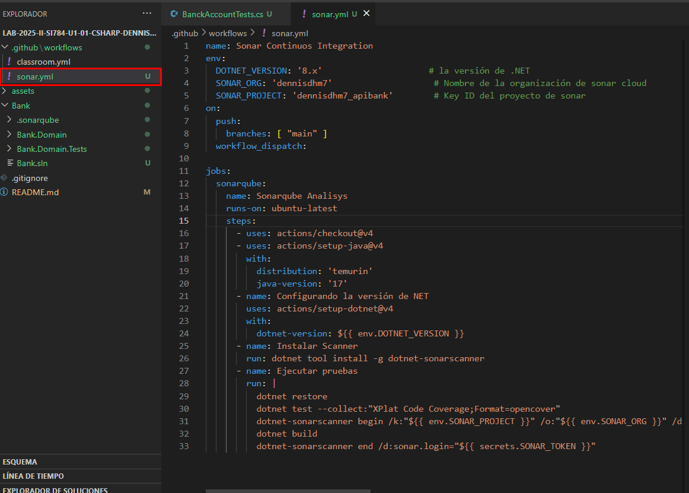

---
## Actividades Encargadas
1. Adicionar un metodos de prueba para verificar el método de crédito.

    1.1. Agregamos un nuevo metodo credito en Bank/Bank.Domain.Tests/BankAccountTests.cs

    ```C#
      [TestMethod] // 👈 NUEVO: prueba de crédito
        public void Credit_WithValidAmount_UpdatesBalance()
        {
            // Arrange
            var account = new BankAccount("User", 10.00);
            // Act
            account.Credit(5.25);
            // Assert
            Assert.AreEqual(15.25, account.Balance, 0.001, "Account not credited correctly");
        }

        // (Opcional) Casos frontera aumentan cobertura:
        [TestMethod]
        public void Credit_WithNegativeAmount_Throws()
        {
            var account = new BankAccount("User", 10.00);
            Assert.ThrowsException<ArgumentOutOfRangeException>(() => account.Credit(-1));
        }
    ```

    1.2. Ejecutar cobertura + enviar a SonarCloud desde Bank/

    ```Bash
    dotnet sonarscanner begin /k:"dennisdhm7_apibank" /o:"dennisdhm7" /d:sonar.token="TU_TOKEN" /d:sonar.host.url="https://sonarcloud.io" /d:sonar.cs.opencover.reportsPaths="**/TestResults/**/coverage.opencover.xml"
    dotnet build --no-incremental
    dotnet test --collect:"XPlat Code Coverage;Format=opencover"
    dotnet sonarscanner end /d:sonar.token="TU_TOKEN"
    ```
    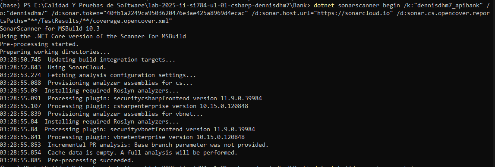
    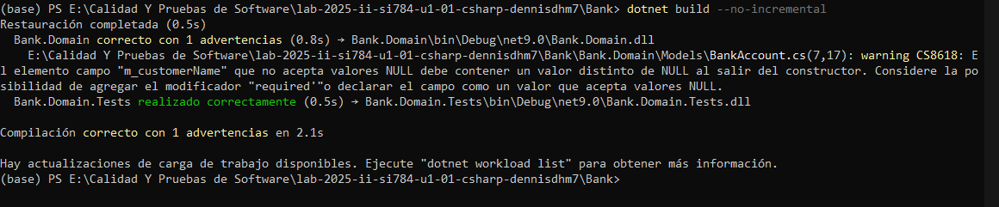
    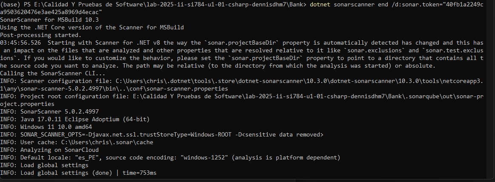
    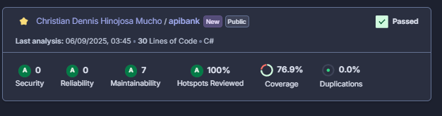

2. Adjuntar la captura donde se evidencia el incremento del valor de cobertura en SonarCloud en un archivo cobertura.png.

    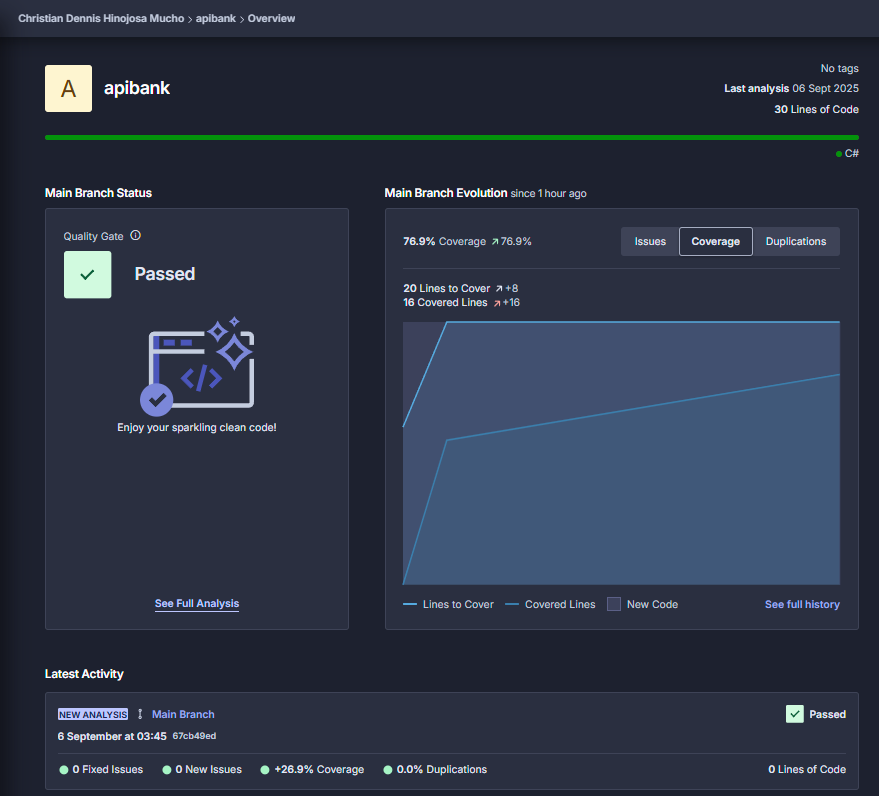

3. Adicionar a la automatizacion la construcción del archivo .nuget y la publicación como paquete en su repositorio de Github

    3.1. Preparamos el archivo Bank.Domain.csproj para empaquetar, editamos Bank/Bank.Domain/Bank.Domain.csproj:
    ```Bash
    <Project Sdk="Microsoft.NET.Sdk">

      <PropertyGroup>
        <TargetFramework>net9.0</TargetFramework>
        <ImplicitUsings>enable</ImplicitUsings>
        <Nullable>enable</Nullable>

        <GeneratePackageOnBuild>false</GeneratePackageOnBuild>
        <PackageId>Bank.Domain</PackageId>
        <Version>1.0.0</Version> 
        <Authors>ORGANIZACION</Authors>
        <Company>ORGANIZACION</Company>
        <Description>Domain models for Bank.</Description>
        <RepositoryUrl>URL_REPOSITORIO</RepositoryUrl>
        <PackageLicenseExpression>MIT</PackageLicenseExpression>
        <PackageRequireLicenseAcceptance>false</PackageRequireLicenseAcceptance>
      </PropertyGroup>

    </Project>
    ```
    3.2. Editamos .github/workflows/sonar.yml

    ```Yaml
    name: CI - Build, Test, Sonar & Publish NuGet

    env:
      DOTNET_VERSION: '8.x'
      SONAR_ORG: 'dennisdhm7'
      SONAR_PROJECT: 'dennisdhm7_apibank'
      PACKAGE_VERSION: '1.0.0'
      NUGET_SOURCE_NAME: 'github'
      NUGET_SOURCE_URL: 'https://nuget.pkg.github.com/UPT-FAING-EPIS/index.json'

    on:
      push:
        branches: [ "main" ]
      pull_request:
        branches: [ "main" ]
      workflow_dispatch:

    jobs:
      build-test-sonar-pack-publish:
        permissions:
          contents: write
          packages: write
        runs-on: ubuntu-latest
        steps:
          - uses: actions/checkout@v4
            with: { fetch-depth: 0 }

          - uses: actions/setup-java@v4
            with:
              distribution: 'temurin'
              java-version: '17'

          - uses: actions/setup-dotnet@v4
            with:
              dotnet-version: ${{ env.DOTNET_VERSION }}

          - name: Restore (NuGet)
            run: dotnet restore

          - name: Show NuGet sources
            run: dotnet nuget list source

          - name: Install SonarScanner
            run: dotnet tool install -g dotnet-sonarscanner

          - name: Build, Test & Sonar
            env:
              SONAR_TOKEN: ${{ secrets.SONAR_TOKEN }}
            run: |
              dotnet-sonarscanner begin /k:"${{ env.SONAR_PROJECT }}" /o:"${{ env.SONAR_ORG }}" /d:sonar.login="${{ secrets.SONAR_TOKEN }}" /d:sonar.host.url="https://sonarcloud.io" /d:sonar.cs.opencover.reportsPaths="**/TestResults/**/coverage.opencover.xml" /d:sonar.qualitygate.wait=true
              dotnet build --no-incremental
              dotnet test --collect:"XPlat Code Coverage;Format=opencover"
              dotnet-sonarscanner end /d:sonar.login="${{ secrets.SONAR_TOKEN }}"

          - name: Pack NuGet
            run: dotnet pack Bank/Bank.Domain/Bank.Domain.csproj -c Release -o out /p:Version=${{ env.PACKAGE_VERSION }}

          - name: Add GitHub Packages source
            run: dotnet nuget add source ${{ env.NUGET_SOURCE_URL }} --name ${{ env.NUGET_SOURCE_NAME }} --username ${{ github.actor }} --password ${{ secrets.GITHUB_TOKEN }} --store-password-in-clear-text

          - name: Push package to GitHub Packages
            run: dotnet nuget push out/*.nupkg --api-key ${{ secrets.GITHUB_TOKEN }} --source ${{ env.NUGET_SOURCE_NAME }} --skip-duplicate

    ```

4. Adicionar a la automatizacion la generación del release de la versión 1.0.0 del nuget, debe indicar las modificaciones del paquete en base a los comentarios de los commits realizados
    ```Yaml
    name: CI - SonarCloud, Tests, NuGet y Release

    env:
      DOTNET_VERSION: '9.x'                         
      SONAR_ORG: 'dennisdhm7'                       # Organization Key en SonarCloud
      SONAR_PROJECT: 'dennisdhm7_apibank'           # Project Key en SonarCloud
      PACKAGE_VERSION: '1.0.0'                      # Versión del paquete NuGet
      NUGET_SOURCE_NAME: 'github'
      NUGET_SOURCE_URL: 'https://nuget.pkg.github.com/UPT-FAING-EPIS/index.json'

    on:
      push:
        branches: [ "main" ]
      pull_request:
        branches: [ "main" ]
      workflow_dispatch:

    jobs:
      build-test-sonar-pack-publish:
        name: Build, Test, Sonar y Publicación de NuGet
        runs-on: ubuntu-latest
        permissions:
          contents: write
          packages: write
        steps:
          - name: Checkout
            uses: actions/checkout@v4
            with:
              fetch-depth: 0

          - name: Setup Java (para SonarScanner)
            uses: actions/setup-java@v4
            with:
              distribution: 'temurin'
              java-version: '17'

          - name: Setup .NET
            uses: actions/setup-dotnet@v4
            with:
              dotnet-version: ${{ env.DOTNET_VERSION }}

          - name: Restore (NuGet)
            run: dotnet restore

          - name: Mostrar fuentes NuGet
            run: dotnet nuget list source

          - name: Instalar SonarScanner
            run: dotnet tool install -g dotnet-sonarscanner

          - name: Build, Test y SonarCloud
            env:
              SONAR_TOKEN: ${{ secrets.SONAR_TOKEN }}
            run: |
              dotnet-sonarscanner begin /k:"${{ env.SONAR_PROJECT }}" /o:"${{ env.SONAR_ORG }}" /d:sonar.login="${{ secrets.SONAR_TOKEN }}" /d:sonar.host.url="https://sonarcloud.io" /d:sonar.cs.opencover.reportsPaths="**/TestResults/**/coverage.opencover.xml" /d:sonar.qualitygate.wait=true
              dotnet build --no-incremental
              dotnet test --collect:"XPlat Code Coverage;Format=opencover"
              dotnet-sonarscanner end /d:sonar.login="${{ secrets.SONAR_TOKEN }}"

          - name: Empaquetar (dotnet pack)
            run: dotnet pack Bank/Bank.Domain/Bank.Domain.csproj -c Release -o out /p:Version=${{ env.PACKAGE_VERSION }}

          - name: Agregar fuente GitHub Packages
            run: dotnet nuget add source ${{ env.NUGET_SOURCE_URL }} --name ${{ env.NUGET_SOURCE_NAME }} --username ${{ github.actor }} --password ${{ secrets.GITHUB_TOKEN }} --store-password-in-clear-text

          - name: Publicar paquete en GitHub Packages
            run: dotnet nuget push out/*.nupkg --api-key ${{ secrets.GITHUB_TOKEN }} --source ${{ env.NUGET_SOURCE_NAME }} --skip-duplicate

      create-release:
        name: Crear Release v1.0.0 con notas de commits
        needs: build-test-sonar-pack-publish
        runs-on: ubuntu-latest
        permissions:
          contents: write
        steps:
          - name: Checkout (con historial completo)
            uses: actions/checkout@v4
            with:
              fetch-depth: 0

          - name: Crear tag v1.0.0 si no existe
            shell: bash
            run: |
              if ! git rev-parse -q --verify "refs/tags/v1.0.0"; then
                git tag v1.0.0
                git push origin v1.0.0
              fi

          - name: Crear Release v1.0.0 (notas automáticas) y adjuntar .nupkg
            uses: softprops/action-gh-release@v1
            with:
              tag_name: v1.0.0
              name: v1.0.0
              generate_release_notes: true        # Genera notas a partir de mensajes de commits/PRs
              files: |
                out/*.nupkg                       # Asegúrate que el pack dejó el .nupkg en 'out/'
            env:
              GITHUB_TOKEN: ${{ secrets.GITHUB_TOKEN }}
    ```